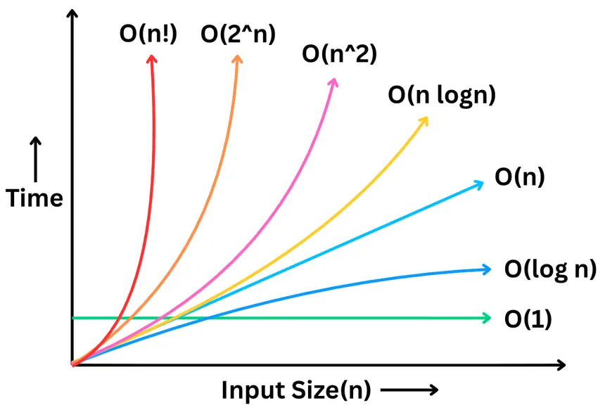

# Big O Notation

This is a unit of measuring the time complexity or space complexity of an algorithm.

---

## TIME COMPLEXITY

_So, it's basically the time taken to run an algorithm?_ **No, it isn't!**

For instance, let's imagine you wrote a program.  
If you run that program in an old computer, it'll take approx. 4 seconds.  
If you run the same program in a brand new computer, it'll take approx. 1.5 second.

See? This is why we can't measure the time complexity of a program by the time taken. The time taken depends on the machine, not on the algorithm.

_So, how do we actually measure the time complexity of a program?_

That's why **Big O Notation** exists.

Big O Notation is defined as the rate of change of the algorithm's performance with respect to the input size.  
Basically, Big O Notation describes how slow/fast your code gets as input grows.  
**It's not machine-dependent like "time taken to run a program".**

 

- [**O(1)** ➜ Constant Time](./assets/READMEs/o-1.md)
- [**O(log n)** ➜ Logarithmic Time](./assets/READMEs/o-log-n.md)
- [**O(n)** ➜ Linear Time](./assets/READMEs/o-n.md)
- [**O(n log n)** ➜ Linearithmic Time](./assets/READMEs/o-n-log-n.md)
- [**O(n²)** ➜ Quadratic Time](./assets/READMEs/o-n-raised-to-2.md)
- [**O(2ⁿ)** ➜ Exponential Time](./assets/READMEs/o-2-raised-to-n.md)
- [**O(n!)** ➜ Factorial Time](./assets/READMEs/o-n-factorial.md)

---